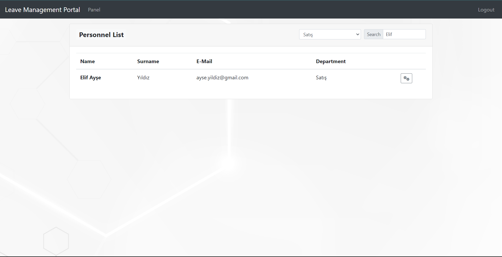
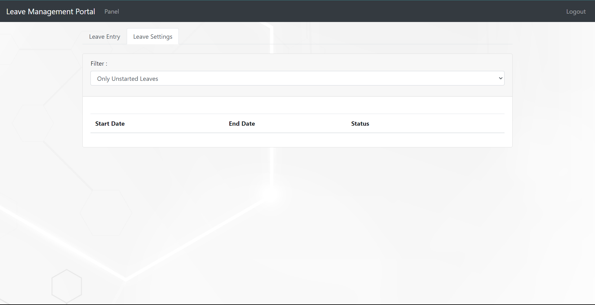

# Personnel-Leave-Management-System
 Kafein Technology Internship Project / Full Stack Web Application Development using Flask Framework and jQuery

    <h3><strong>Screenshots from demo : </strong></h3>
        <table>
          <tr>
            <td></td>
            <td></td>
          </tr>
          <tr>
            <td></td>
            <td></td>
          </tr>
           <tr>
            <td></td>
            <td></td>
          </tr>
          <tr>
            <td></td>
            <td></td>
          </tr>
           <tr>
            <td></td>
            <td></td>
          </tr>
           <tr>
            <td></td>
            <td></td>
          </tr>
          <tr>
            <td></td>
            <td></td>
          </tr>
          <tr>
            <td></td>
          </tr>    
        </table>
        

